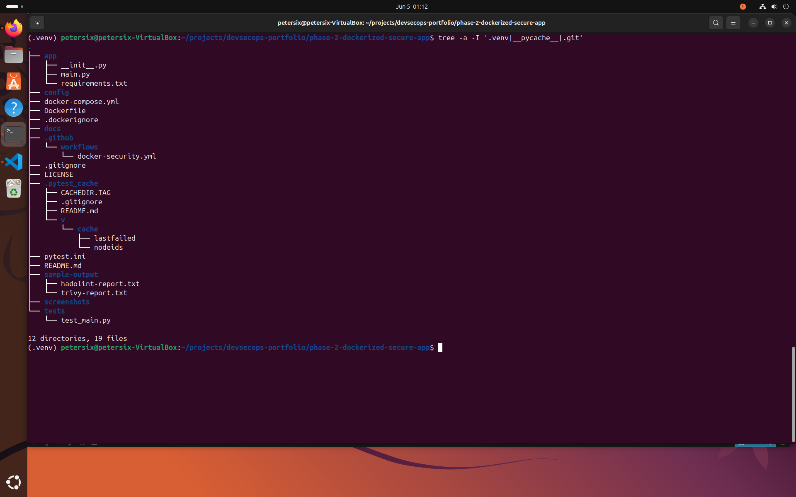
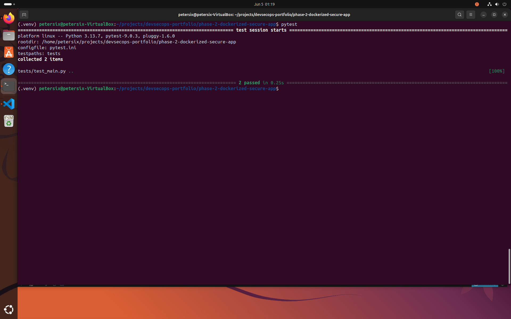
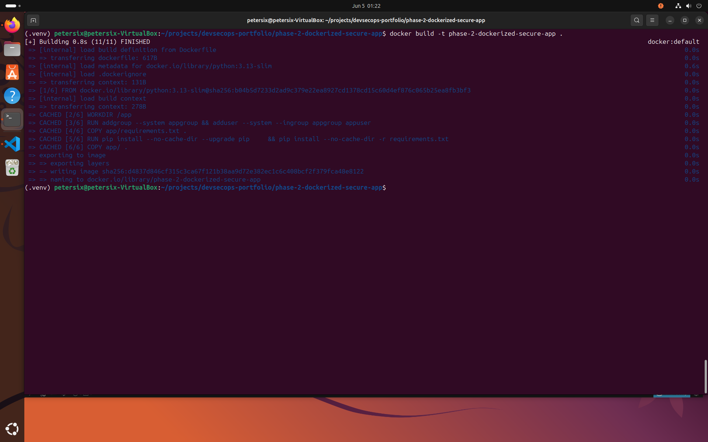
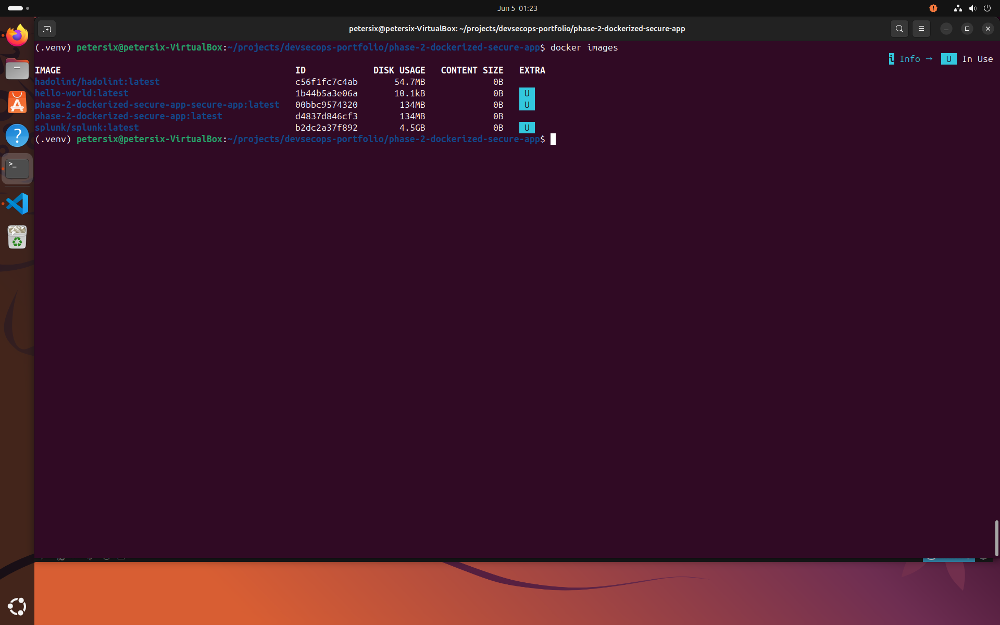
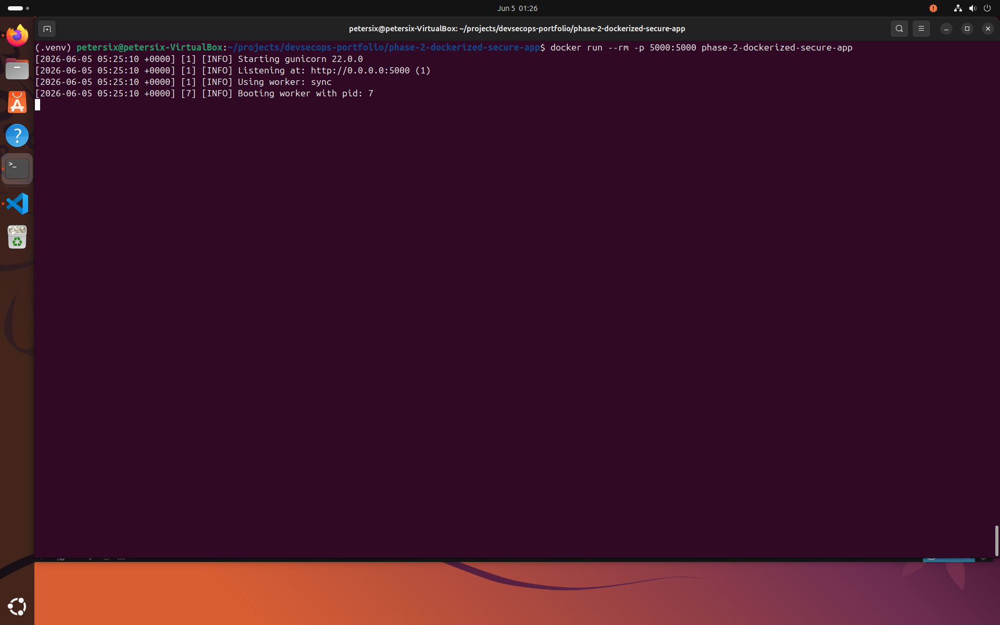
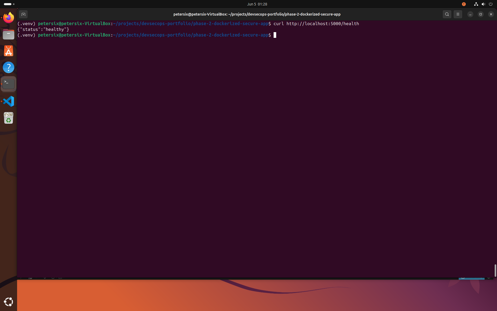
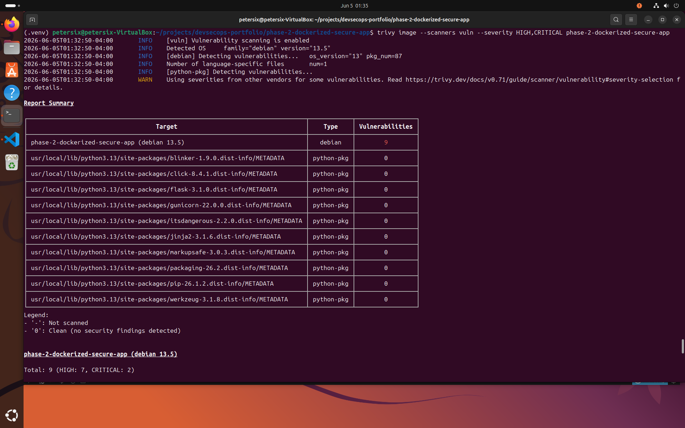
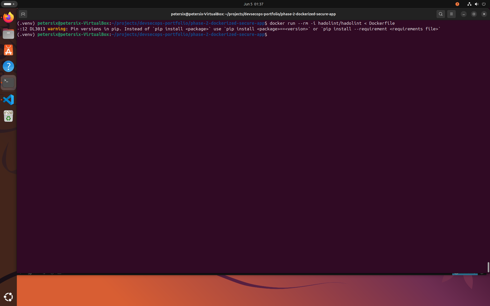
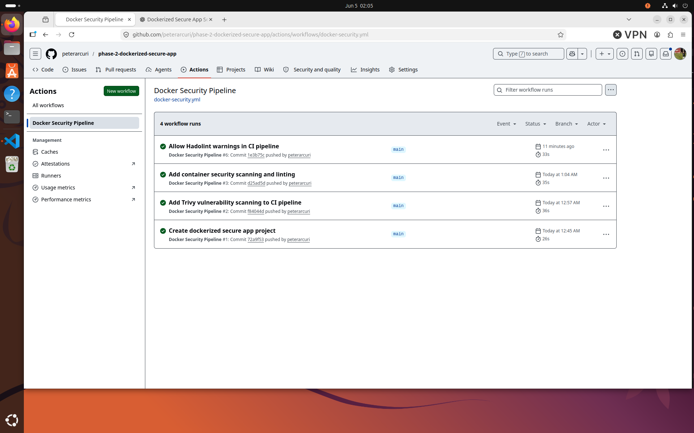

# Phase 2 — Dockerized Secure App

A secure, containerized Python web application built as part of my DevSecOps Engineering portfolio.

This project focuses on Docker containerization, container hardening, automated testing, vulnerability scanning, Dockerfile linting, and CI/CD automation using GitHub Actions.

---

# Objectives

This project was designed to strengthen practical DevSecOps skills in:

* Docker containerization
* Secure application deployment
* Container hardening
* Vulnerability management
* CI/CD automation
* Secure software delivery
* Infrastructure security validation

---

# Features

## Current Features

* Dockerized Flask application
* Non-root container execution
* Docker Compose deployment
* Health check endpoint
* Automated Pytest testing
* GitHub Actions CI/CD pipeline
* Trivy vulnerability scanning
* Hadolint Dockerfile linting
* Container runtime hardening

---

## Security Features

* Minimal Python Slim base image
* Non-root container user
* Read-only container filesystem
* Linux capability dropping
* No-new-privileges enforcement
* Automated vulnerability scanning
* Automated Dockerfile linting
* CI/CD security validation

---

# Technology Stack

* Python 3.13
* Flask
* Gunicorn
* Docker
* Docker Compose
* Pytest
* GitHub Actions
* Trivy
* Hadolint

---

# Project Structure

```text
phase-2-dockerized-secure-app/
├── app
│   ├── __init__.py
│   ├── main.py
│   └── requirements.txt
├── config
├── docker-compose.yml
├── Dockerfile
├── .dockerignore
├── docs
├── .github
│   └── workflows
│       └── docker-security.yml
├── .gitignore
├── LICENSE
├── pytest.ini
├── README.md
├── sample-output
│   ├── hadolint-report.txt
│   ├── trivy-high-critical-report.txt
│   └── trivy-report.txt
├── screenshots
└── tests
    └── test_main.py
```

---

# Installation

Create and activate a Python virtual environment:

```bash
python3 -m venv .venv
source .venv/bin/activate
```

Install dependencies:

```bash
pip install -r app/requirements.txt
pip install pytest
```

---

# Running Tests

Execute the test suite:

```bash
pytest
```

---

# Build Docker Image

Build the application image:

```bash
docker build -t phase-2-dockerized-secure-app .
```

---

# Run Container

Start the container:

```bash
docker run --rm -p 5000:5000 phase-2-dockerized-secure-app
```

Verify application health:

```bash
curl http://localhost:5000/health
```

---

# Run with Docker Compose

```bash
docker compose up --build
```

Stop the application:

```bash
docker compose down
```

---

# Container Vulnerability Scanning

Scan the image using Trivy:

```bash
trivy image phase-2-dockerized-secure-app
```

Focused HIGH and CRITICAL scan:

```bash
trivy image --scanners vuln --severity HIGH,CRITICAL phase-2-dockerized-secure-app
```

---

# Dockerfile Linting

Run Hadolint:

```bash
docker run --rm -i hadolint/hadolint < Dockerfile
```

---

# CI/CD Pipeline

The GitHub Actions workflow automatically performs:

1. Source Code Checkout
2. Python Dependency Installation
3. Automated Pytest Execution
4. Dockerfile Linting (Hadolint)
5. Docker Image Build
6. Container Vulnerability Scanning (Trivy)

Pipeline configuration:

```text
.github/workflows/docker-security.yml
```

---

# Sample Security Reports

Generated reports:

```text
sample-output/
├── hadolint-report.txt
├── trivy-high-critical-report.txt
└── trivy-report.txt
```

---

# Screenshots

## Project Structure

Shows the final project layout and DevSecOps repository organization.



---

## Automated Testing

Pytest execution validating application functionality.



---

## Docker Build Success

Successful Docker image build process.



---

## Docker Image Creation

Docker image successfully created and available locally.



---

## Running Container

Containerized application running with Gunicorn.



---

## Health Check Validation

Application health endpoint verification.



---

## Trivy Vulnerability Scan

Container image vulnerability assessment using Trivy.



---

## Hadolint Dockerfile Analysis

Dockerfile linting and best-practice validation.



---

## GitHub Actions CI/CD Pipeline

Automated DevSecOps workflow execution.



---

# Skills Demonstrated

* Docker Containerization
* Container Hardening
* Secure Image Design
* Non-Root Container Execution
* Docker Compose
* Python Application Deployment
* Automated Testing with Pytest
* GitHub Actions CI/CD
* Trivy Vulnerability Scanning
* Hadolint Dockerfile Linting
* Secure Software Delivery
* DevSecOps Automation
* Infrastructure Security Validation

---

# Future Enhancements

* Multi-stage Docker builds
* Container image signing with Cosign
* Software Bill of Materials (SBOM) generation
* Kubernetes deployment manifests
* Infrastructure as Code integration
* Automated dependency update workflows
* Security policy enforcement gates

---

# Disclaimer

This project was created for educational and portfolio purposes to demonstrate practical DevSecOps engineering concepts, secure containerization, and CI/CD security automation.
